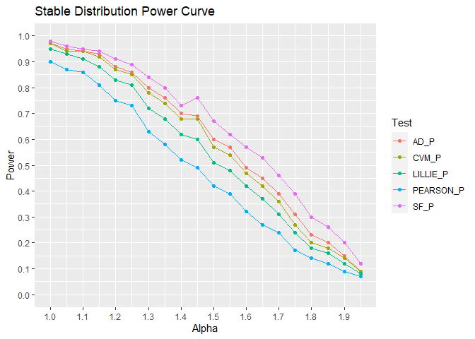
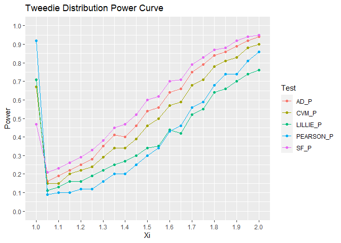

## Which Goodness of Fit Test is Best?

There are many goodness of fit tests for checking normality. Which test
is best? Is one test best in some situations and another test best in
other situations? This repo puts five hypothesis tests head to head to
see if one stands out.

Tests:

- Anderson-Darling test
- Cramer-von Mises test
- Kolmogorov-Smirnov test
- Pearson chi-square test
- Shapiro-Francia test

## Experimental Design

Each row is an experiment. Thirty data points are randomly generated and
the five hypothesis tests are done. This process is repeated 1,000
times. Non-normality is controlled by varying the parameter value of the
true distribution. The first 10 rows look like

    # A tibble: 20,000 × 7
       param iteration   AD_P  CVM_P LILLIE_P PEARSON_P   SF_P
       <dbl>     <dbl>  <dbl>  <dbl>    <dbl>     <dbl>  <dbl>
     1     1         1 0      0        0         0.0012 0     
     2     1         2 0      0        0         0      0     
     3     1         3 0      0        0         0      0     
     4     1         4 0      0        0.0001    0.0001 0     
     5     1         5 0      0        0         0      0     
     6     1         6 0.0017 0.0057   0.122     0.136  0.0003
     7     1         7 0      0        0         0.0001 0     
     8     1         8 0      0        0         0      0     
     9     1         9 0      0        0         0      0     
    10     1        10 0      0        0         0      0     
    # … with 19,990 more rows
    # ℹ Use `print(n = ...)` to see more rows

For each combination of hypothesis test and parameter value, the 1,000
experiments are aggregated to calculate power.

    # A tibble: 100 × 3
       param test      power
       <dbl> <chr>     <dbl>
     1  1    AD_P       0.97
     2  1    CVM_P      0.97
     3  1    LILLIE_P   0.95
     4  1    PEARSON_P  0.9 
     5  1    SF_P       0.98
     6  1.05 AD_P       0.95
     7  1.05 CVM_P      0.94
     8  1.05 LILLIE_P   0.93
     9  1.05 PEARSON_P  0.87
    10  1.05 SF_P       0.96
    # … with 90 more rows
    # ℹ Use `print(n = ...)` to see more rows

## Stable Distribution

The stable distribution provides a way of quantifying how non-normal the
data is. When alpha is two, the stable distribution is the same as the
Gaussian distribution. As alpha gets further from two, the data gets
less and less normal. When alpha is one, the stable distribution is the
same as the Cauchy distribution.

No matter how non-normal the data is, the Shapiro-Francia test is always
best. The Anderson-Darling test is second best.

## Tweedie Distribution

The Tweedie distribution provides another way of controlling
non-normality. When xi is one, the Tweedie distribution is the same as a
Poisson distribution. As xi increases, the Tweedie distribution is a
compound poisson gamma distribution. When it is two, the Tweedie
distribution is the same as a gamma distribution.

No matter where the data falls between Poisson and gamma, the
Shapiro-Francia test is always best. The Anderson-Darling test is second
best.
